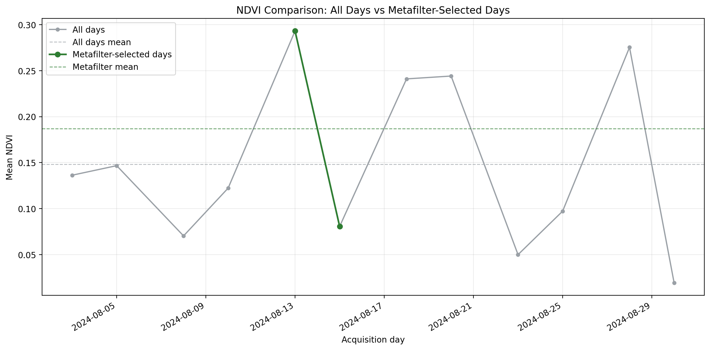
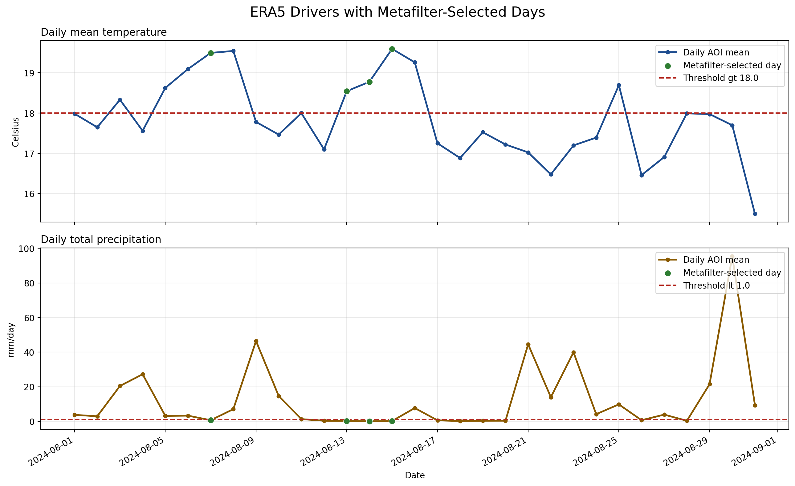
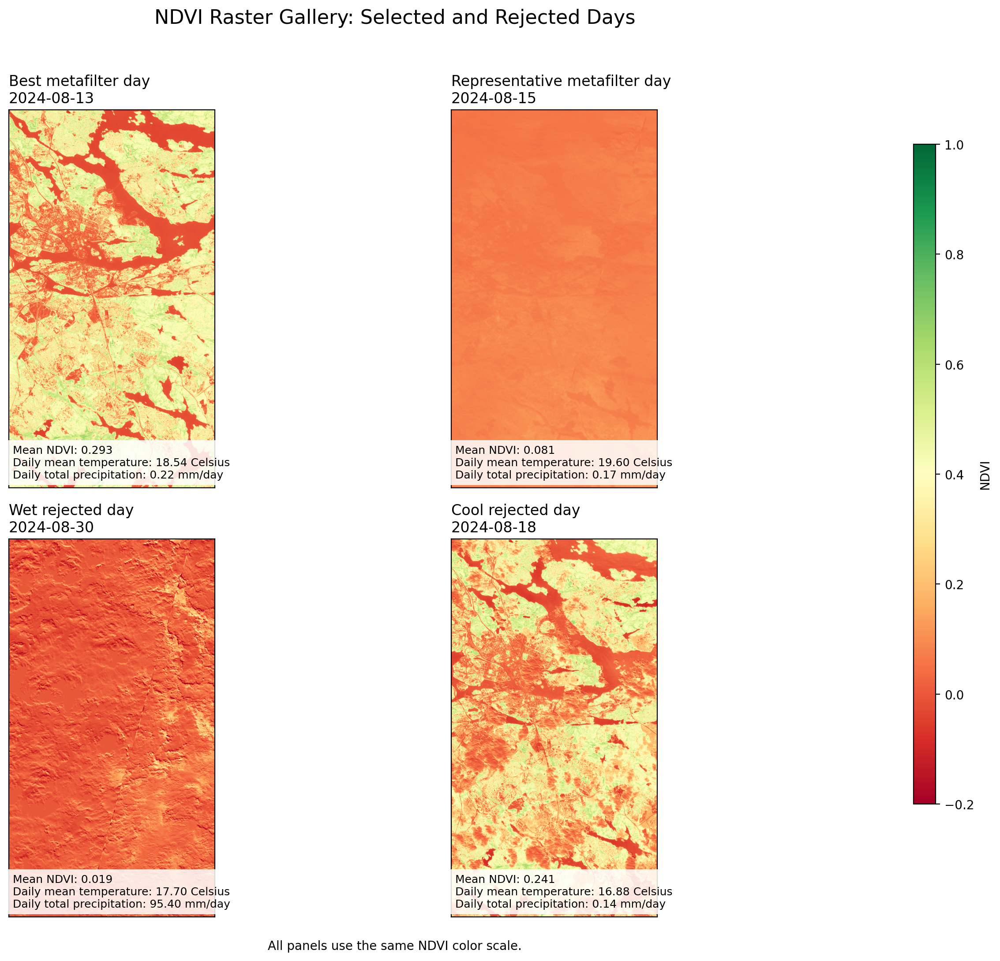

# Metafilter

## Overview

This provides a pipeline to process ERA5-Land meteorological data, retrieve Sentinel-2 data through an openEO backend (Digital Earth Sweden by default), calculate NDVI rasters, and compare a plain "all days" strategy against a weather-driven metafilter strategy.

Essentially it is a demonstration of how meteorological metadata can be used to narrow down when it is worth looking for Sentinel-2 L2A imagery, and whether that produces an NDVI time series with higher values than an unfiltered query.

The work was co-developed with partners in the Space Data Lab 3.0 project.

---

## Features

1. **Download ERA5-Land Data**:
   - Uses the CDSAPI to fetch ERA5-Land weather data for a specified time period and area.

2. **Process ERA5 Data**:
   - Extracts dates that meet specific weather criteria (e.g., temperature thresholds and precipitation levels). This uses a predefined filter in JSON format (see filters/metafilter.json).

3. **Authenticate and Query Sentinel-2 Data**:
   - Retrieves Sentinel-2 data for the selected dates and area of interest using openEO (`load_collection` + `download`).
   - The default backend configured in this repo is Digital Earth Sweden (`https://openeo.digitalearth.se`).

4. **Compare NDVI Outcomes**:
   - Calculates NDVI rasters from retrieved Sentinel-2 data and generates a plot comparing all candidate days against metafilter-selected days.

---

## Supported Data Fetching Modes

This repository currently supports two external data-fetching modes:

1. **ERA5-Land meteorology via CDS API**
   - Script: `scripts/download_era5.py`
   - Backend/service: Copernicus Climate Data Store (`cdsapi.Client().retrieve(...)`)
   - Purpose: Download weather variables used for filtering dates.

2. **Sentinel-2 imagery via openEO backend**
   - Script: `scripts/search_sentinel.py`
   - Backend/service: openEO backend URL configured in `utils/config.py` (`eo_service_url`)
   - Default backend in this repo: Digital Earth Sweden (`https://openeo.digitalearth.se`)
   - Purpose: Query/download Sentinel-2 (`s2_msi_l2a`) for filtered temporal and spatial extents.

---

## Installation and Setup

1. **Install Conda or Python Virtual Environment Manager**:
   - [Miniconda](https://docs.conda.io/en/latest/miniconda.html) or [Virtualenv](https://virtualenv.pypa.io/en/latest/).

2. **Set up the environment**:
   ```bash
   # Clone the repository
   git clone https://github.com/your-username/metafilter.git
   cd metafilter

   # Create and activate a virtual environment
   conda create -n metafilter-env python=3.12 -y
   conda activate metafilter-env

   # Install required Python packages
   pip install -r requirements.txt
   ```

3. **Configure Your Environment**:
   - Update the following values in `utils/config.py` or `.env`:
     - `AREA`: The geographical bounding box of the area of interest (northern half of Sweden by default).
     - `eo_service_url`: openEO backend URL (default: `https://openeo.digitalearth.se`).
     - `OPENEO_USERNAME` / `OPENEO_PASSWORD`: Credentials for the selected openEO backend.
   - For ERA5 download (`scripts/download_era5.py`), configure CDS API access for your Copernicus Climate Data Store account.

---

## Usage

Run the project using the main script:

```bash
python main.py
```

### Workflow Steps

1. **Download ERA5-Land Data**:
   - If you need to refresh the ERA5 input file, run `python scripts/download_era5.py`.

2. **Process ERA5 Data**:
   - Automatically filters ERA5-Land data to identify dates matching specified weather conditions over the configured AOI.
   - The active rules are defined in `filters/metafilter.json`, including the metric column, operator, threshold, unit, and description used for diagnostics.

3. **Authenticate and Query Sentinel-2 Data**:
   - Connects to the configured openEO backend (Digital Earth Sweden by default) to fetch Sentinel-2 data for each day in the full period and each metafilter-selected day.

4. **Generate NDVI Comparison Plot**:
   - Produces `data/ndvi_comparison/ndvi_comparison_plot.png`, which overlays the unfiltered and metafilter-selected NDVI time series.
   - Produces `data/ndvi_comparison/era5_driver_plot.png`, which shows the ERA5 driver variables with metafilter-selected days highlighted.
   - Produces `data/ndvi_comparison/ndvi_raster_gallery.png`, which lays out selected and rejected NDVI rasters using a shared color scale.

---

## Output

- **Console Output**:
  - Prints the paths to the generated NDVI comparison images.

- **Generated Plot**:
  - Outputs `data/ndvi_comparison/ndvi_comparison_plot.png`.
  - Open the image to compare mean NDVI over time for all queried days versus metafilter-selected days.
  - Outputs `data/ndvi_comparison/era5_driver_plot.png`.
  - Open the image to inspect how the ERA5 thresholds relate to the selected days.
  - Outputs `data/ndvi_comparison/ndvi_raster_gallery.png`.
  - Open the image to compare representative selected and rejected NDVI rasters side by side.

---

## Results Example

This section shows how to interpret a completed run using the generated figures and `data/ndvi_comparison/ndvi_comparison_summary.json`.

The goal of this example is simple: to test whether meteorological filtering with ERA5-Land can reduce the number of Sentinel-2 candidate days while still keeping the days that give the most useful NDVI results. In practice, it is trying to show that the metafilter works as a useful screening step rather than an arbitrary extra constraint. The ERA5-Land datasets used were selected after discussions with the Swedish Environmental Protection Agency, Swedish Forrestry Agency and Stockholm University, among others.

The conclusion we want to support with the figures and summary is also simple: metafilter is useful if it narrows the search window, improves or preserves the NDVI quality of the retained scenes, and does not discard the best day in the period.

### Data used

- **Meteorological data**: ERA5-Land hourly `2m_temperature` and `total_precipitation`, aggregated to daily AOI means.
- **Satellite data**: Sentinel-2 L2A (`s2_msi_l2a`) from the Digital Earth Sweden openEO backend.
- **NDVI inputs**: Sentinel-2 bands `b04` (red) and `b08` (near-infrared).

### Parameters in the example run

- **AOI**: Stockholm area bounding box from `utils/config.py`
  - `west=18.0`, `east=18.2`, `south=59.2`, `north=59.4`
- **ERA5 filter rules** from `filters/metafilter.json`
  - Daily mean temperature `> 15.0 Celsius`
  - Daily total precipitation `< 1.0 mm/day`
- **ERA5 period** from `scripts/download_era5.py`
  - August 2024 (`2024-08-01` to `2024-08-31`)
- **High NDVI threshold in the summary report**
  - `0.6`
  - This is used in `share_above_threshold`; it is a reporting threshold, not part of the metafilter itself.

### Generated figures

The images rendered below are checked-in example outputs stored in `example_images/`. A local run still writes fresh outputs to `data/ndvi_comparison/`.

#### NDVI comparison over time



This plot compares per-day AOI mean NDVI for:

- **All days**: every candidate day in the ERA5 time range
- **Metafilter-selected days**: only days that pass the ERA5 temperature and precipitation rules

The dashed gray and green lines show the average NDVI of each series.

#### ERA5 drivers behind the selection



This plot shows the daily ERA5 driver variables used by the metafilter and highlights the selected days. It makes the filtering logic visible:

- warm days pass the temperature rule
- dry days pass the precipitation rule
- only days passing both rules are forwarded to the Sentinel-2 comparison

#### NDVI raster gallery



This gallery compares representative selected and rejected NDVI rasters using a shared color scale. It is useful for visually checking whether the metafilter tends to keep greener, cleaner scenes and discard less useful ones.

### What the summary report means

The `ndvi_comparison_summary.json` file reports:

- `candidate_days`: number of daily query windows considered for a strategy
- `successful_days`: number of days that produced a usable NDVI raster
- `error_days`: number of daily queries that did not return a usable raster
- `mean_of_mean_ndvi`: average of the per-day AOI mean NDVI values
- `median_of_mean_ndvi`: median of the per-day AOI mean NDVI values
- `share_above_threshold`: share of successful days with AOI mean NDVI at or above `ndvi_threshold`
- `best_day` / `best_day_mean_ndvi`: strongest daily NDVI result found for that strategy
- `candidate_day_reduction`: how much the metafilter reduced the number of candidate days compared with baseline
- `mean_ndvi_delta`: metafilter `mean_of_mean_ndvi` minus baseline `mean_of_mean_ndvi`
- `share_above_threshold_delta`: metafilter `share_above_threshold` minus baseline `share_above_threshold`

### How to read the example result

In one Stockholm August 2024 run, the summary reported:

- baseline: `31` candidate days, `12` successful days, `19` error days
- metafilter: `4` candidate days, `2` successful days, `2` error days
- `candidate_day_reduction`: `0.871`
- `mean_of_mean_ndvi`: `0.148` for baseline and `0.1869` for metafilter
- `mean_ndvi_delta`: `0.0389`
- the same best day was retained in both strategies: `2024-08-13` with `best_day_mean_ndvi = 0.2932`

This is the core usefulness claim of the project:

- the metafilter reduced the number of candidate days by about `87%`
- it increased the average NDVI of the retained series
- it still preserved the best-scoring day in the month

In that example, `share_above_threshold` stayed at `0.0` for both strategies because no successful day reached the reporting threshold of `0.6`. That does not invalidate the metafilter; it simply means the chosen AOI and month did not produce very high AOI-average NDVI values under that threshold.

When reading `error_days`, keep in mind that the baseline currently queries every calendar day. Some of those days do not have a usable Sentinel-2 result for the AOI, so reducing `error_days` is also part of the practical value of the metafilter.

---

## Directory Structure

```plaintext
.
├── README.md                  # Project overview (this file)
├── license.txt                # APACHE 2.0 license and copyright notice
├── data/                      # Stores ERA5 and Sentinel data
│   ├── era5/                  # ERA5-Land weather data
│   └── sentinel/              # Placeholder for Sentinel imagery (if downloaded)
├── main.py                    # Main entry point for the project
├── requirements.txt           # Required Python dependencies
├── scripts/                   # Core functionality scripts
│   ├── compare_ndvi.py        # Downloads Sentinel-2 NDVI rasters and plots the comparison
│   ├── download_era5.py       # Downloads ERA5-Land data
│   ├── process_era5.py        # Processes ERA5 data to filter dates
│   ├── search_sentinel.py     # Queries/downloads Sentinel-2 data via openEO
│   └── visualize.py           # Legacy footprint visualization helper
├── filters/                   # Stores JSON filters used in the processing
│   └── metafilter.json        # An example metadata filter JSON
└── utils/                     # Utility scripts and configurations
    └── config.py              # Configuration file for API credentials and settings
```

---

## Notes

- Sentinel-2 retrieval uses openEO credentials configured through `.env` or `utils/config.py` and the configured `eo_service_url` (Digital Earth Sweden by default).
- ERA5-Land download requires a registered account with the [Copernicus Climate Data Store](https://cds.climate.copernicus.eu/) and CDS API setup.

For questions or issues, feel free to open an issue in the repository.

## Licensing and Copyright

All material in this repository follows the copyright and licensing as detailed in license.txt in the root directory of the repository.
